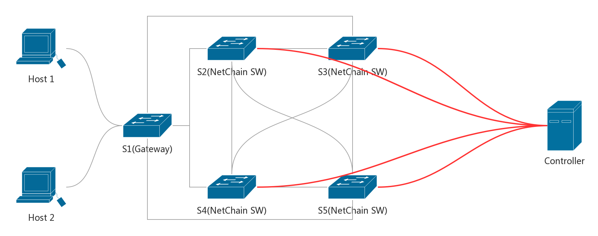

# Project group15(NetChain)

#### Authors
    * Francisco Dumont (fdumontd@student.ethz.ch)
    * Haoyu Zhu (haozhu@student.ethz.ch)

# Introduction

TODO

# NetChain basis

other things TODO

## NetChain UDP messgae frame stracture

### Basic Headers

* Ethernet Header, 14Bytes.
* IPv4 Header, 20Bytes.
* UDP Header, 8Bytes.

### NetChain Headers and payloads

* SC(Chain node counts), 2Bytes, maximum 32.
* S0...Sn(Chain node ip addresses), variable length, maximum 32 nodes, 128Bytes.
* OP(Operation of this queue), 2Bytes.
* SEQ(Sequence number), 4Bytes.
* KEY(Queue key), 2Bytes.
* VALUE(Queue return value), default 0 for read and delete, 8Bytes.

### Topology

